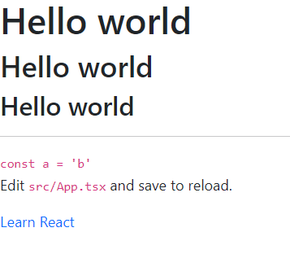

node
v12.22.8
npm
6.14.15

```
// 系统色板 = 基础色板 + 中性色板
// 产品色板 = 品牌色 + 功能色板
```

## 组件库的样式变量分类
```
- 基础色彩系统
- 字体系统
- 表单
- 按钮
- 边框和阴影
- 可配置开关

add => normalize.css -- (_reboot.scss)

normalize 显示元素原本样式(推荐)
resetcss 重置所有样式
```

### sass
### 安装scss依赖
```shell
$    yarn add node-sass --save-dev 
```

### 编译scss文件
```shell
$    npx node-sass src/styles/_variables.scss var.css
$    cat var.css
$    rm -rf var.css  
```


### 完成样式主文件开发




## Button 组件

不同的Button Type

不同的Button Size

Disabled状态


### 规划使用方法
```js
<Button
    size="lg"
    type="primary"
    disabled
    href=""?
    className=""?
    autoFocus=""?
    ...
> 
    Viking Button
</Button>
```

```shell
$ yarn add classnames --save
$ yarn add @types/classnames --save
```

https://github.com/EricWong1994/vikingShipComp/blob/master/src/components/Button/button.tsx


### Button组件测试


## Menu 组件
+ 需求分析
+ 属性分析
+ 调用方法

---
### 1. 编码过程 Menu.tsx

父子属性传值， 决定是那个index被展示，
### 2. Context 来透传属性

通过Context 来透传属性
`父组件`
```tsx
export const MenuContext = React.createContext<IMenuContext>({ index: 0 })


const handleClick = (index:number)=>{
    setActive(index)
    // 看到onSelect 可能存在也可能不存在，需要判断一下， onSelect?: SelectCallback;
    if (onSelect) {// 触发选中后，组件中的回调
        onSelect(index)
    }
}

    // 传递给子组件的context(注入到子组件)
const passedContext: IMenuContext = {
        index: currentActive ? currentActive : 0,// 默认值处理为0
        onSelect: handleClick
}

<MenuContext.Provider value={passedContext}>
     {children}
 </MenuContext.Provider>
```


`子组件`
```tsx
const context = useContext(MenuContext)

const classes = classNames('MenuItem', className, {
    'is-disabled': disabled,
    'is-active': context.index === index
})
// 处理高亮
const handleClick = () => {
    if (context.onSelect && !disabled) {
        context.onSelect(index) // 必须要求组件传递index属性
    }
}
return (
    <li className={classes} style={style} onClick={handleClick}>
        {children}
    </li>
)

```

### 3. 样式美化


---
优化组件实现，
1. 不需要手动添加index值
2. 添加除`MenuItem`组件时候，提示warning
```tsx
    <Menu defaultIndex={0} onSelect={index=>console.log(index)}>
        <MenuItem index={0}>
            cool link
        </MenuItem>
        <MenuItem index={1} disabled>
            cool link2
        </MenuItem>
        <MenuItem index={2}>
            cool link3
        </MenuItem>
    </Menu>
```

优化组件实现:
```tsx
    const renderChildren = ()=>{
        return React.Children.map(children, (child, index)=>{
            // 获取子组件实例 displayName
            const childElement = child as React.FunctionComponentElement<MenuItemProps>
            const { displayName } = childElement.type
            if (displayName === "MenuItem") {
                // return child
                return React.cloneElement(childElement, {// 自动添加 index属性
                    index
                })
            }else{
                console.error("Warning: Menu has a child which is not a MenuItem component.");
            }
        })
    }

    return (
        <ul className={classes} style={style} data-testid="test-menu">
            <MenuContext.Provider value={passedContext}>
                {renderChildren()}
            </MenuContext.Provider>
        </ul>
    )
```


`组件可以这样调用`
```tsx
    <Menu defaultIndex={0} onSelect={index=>console.log(index)}>
        <MenuItem>
            cool link
        </MenuItem>
        <MenuItem disabled>
            cool link2
        </MenuItem>
        <MenuItem>
            cool link3
        </MenuItem>
    </Menu>
```