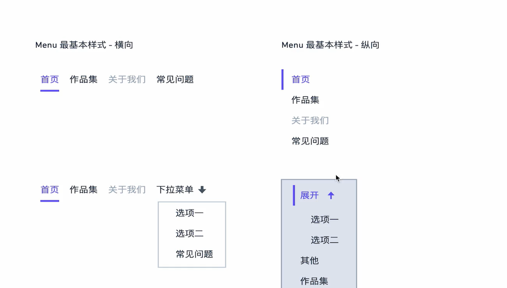
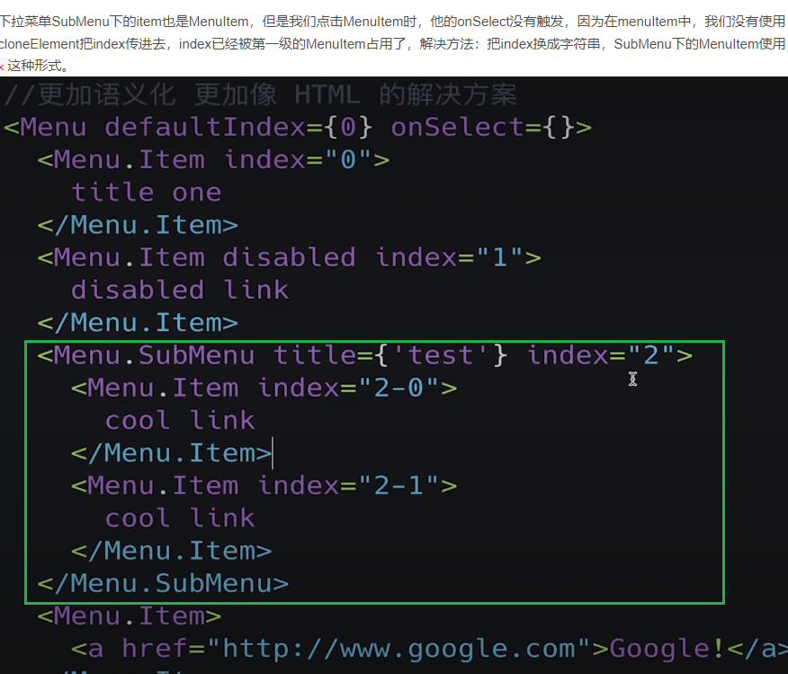
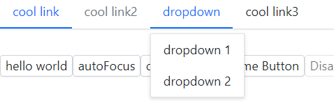
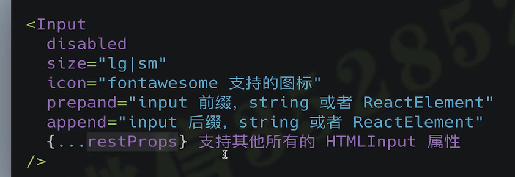
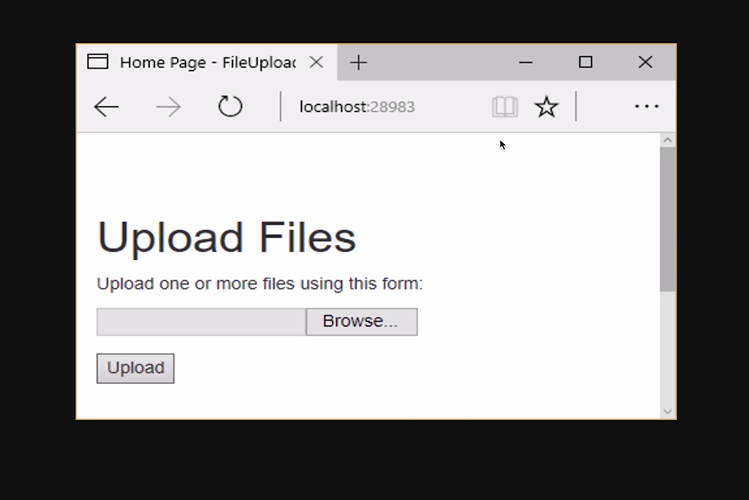
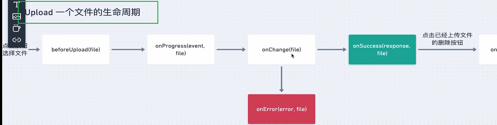
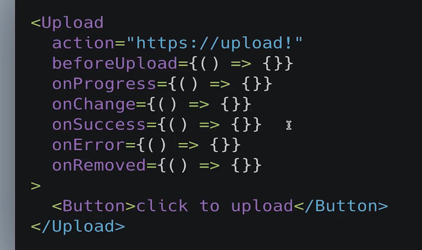

node
v12.22.8
npm
6.14.15

```
// 系统色板 = 基础色板 + 中性色板
// 产品色板 = 品牌色 + 功能色板

```
## 组件库的样式变量分类
```
- 基础色彩系统
- 字体系统
- 表单
- 按钮
- 边框和阴影
- 可配置开关

add => normalize.css -- (_reboot.scss)

normalize 显示元素原本样式(推荐)
resetcss 重置所有样式
```

### sass
### 安装scss依赖
```shell
$    yarn add node-sass --save-dev 
```

### 编译scss文件
```shell
$    npx node-sass src/styles/_variables.scss var.css
$    cat var.css
$    rm -rf var.css  
```


### 完成样式主文件开发


## Button 组件

不同的Button Type

不同的Button Size

Disabled状态


### 规划使用方法
```js
<Button
    size="lg"
    type="primary"
    disabled
    href=""?
    className=""?
    autoFocus=""?
    ...
> 
    Viking Button
</Button>
```

```shell
$ yarn add classnames --save
$ yarn add @types/classnames --save
```

https://github.com/EricWong1994/vikingShipComp/blob/master/src/components/Button/button.tsx


### Button组件测试


## Menu 组件
+ 需求分析
+ 属性分析
+ 调用方法


https://blog.csdn.net/CaraYQ/article/details/122741041
---
### 1. 编码过程 Menu.tsx

父子属性传值， 决定是那个index被展示，
### 2. Context 来透传属性

通过Context 来透传属性
`父组件`
```tsx
export const MenuContext = React.createContext<IMenuContext>({ index: 0 })


const handleClick = (index:number)=>{
    setActive(index)
    // 看到onSelect 可能存在也可能不存在，需要判断一下， onSelect?: SelectCallback;
    if (onSelect) {// 触发选中后，组件中的回调
        onSelect(index)
    }
}

    // 传递给子组件的context(注入到子组件)
const passedContext: IMenuContext = {
        index: currentActive ? currentActive : 0,// 默认值处理为0
        onSelect: handleClick
}

<MenuContext.Provider value={passedContext}>
     {children}
 </MenuContext.Provider>
```


`子组件`
```tsx
const context = useContext(MenuContext)

const classes = classNames('MenuItem', className, {
    'is-disabled': disabled,
    'is-active': context.index === index
})
// 处理高亮
const handleClick = () => {
    if (context.onSelect && !disabled) {
        context.onSelect(index) // 必须要求组件传递index属性
    }
}
return (
    <li className={classes} style={style} onClick={handleClick}>
        {children}
    </li>
)

```

### 3. 样式美化


---
优化组件实现，
1. 不需要手动添加index值
2. 添加除`MenuItem`组件时候，提示warning
```tsx
    <Menu defaultIndex={0} onSelect={index=>console.log(index)}>
        <MenuItem index={0}>
            cool link
        </MenuItem>
        <MenuItem index={1} disabled>
            cool link2
        </MenuItem>
        <MenuItem index={2}>
            cool link3
        </MenuItem>
    </Menu>
```

优化组件实现:
```tsx
    const renderChildren = ()=>{
        return React.Children.map(children, (child, index)=>{
            // 获取子组件实例 displayName
            const childElement = child as React.FunctionComponentElement<MenuItemProps>
            const { displayName } = childElement.type
            if (displayName === "MenuItem") {
                // return child
                return React.cloneElement(childElement, {// 自动添加 index属性
                    index
                })
            }else{
                console.error("Warning: Menu has a child which is not a MenuItem component.");
            }
        })
    }

    return (
        <ul className={classes} style={style} data-testid="test-menu">
            <MenuContext.Provider value={passedContext}>
                {renderChildren()}
            </MenuContext.Provider>
        </ul>
    )
```


`组件可以这样调用`
```tsx
    <Menu defaultIndex={0} onSelect={index=>console.log(index)}>
        <MenuItem>
            cool link
        </MenuItem>
        <MenuItem disabled>
            cool link2
        </MenuItem>
        <MenuItem>
            cool link3
        </MenuItem>
    </Menu>
```
### 4. 展示下拉菜单SubMenu




```tsx
<SubMenu title='dropdown'>
		<MenuItem>
			dropdown 1
		</MenuItem>
		<MenuItem>
			dropdown 2
		</MenuItem>
	</SubMenu>
```


### 5. SubMenu 添加点击事件，与点击事件的状态,纵向模式默认展开


openedSubMenus
``` js
    const openedSubMenus = context.defaultOpenSubMenus as Array<string>

    const isOpened = (index && context.mode === 'vertical')?openedSubMenus.includes(index):false
```

```tsx
    <Menu defaultIndex={'0'} onSelect={index=>console.log(index)} mode='vertical' defaultOpenSubMenus={['2']}>
        <MenuItem>
            cool link
        </MenuItem>
        <MenuItem disabled>
            cool link2
        </MenuItem>
      <SubMenu title='dropdown'>
        <MenuItem>
          dropdown 1
        </MenuItem>
        <MenuItem>
          dropdown 2
        </MenuItem>
      </SubMenu>
      <MenuItem>
            cool link3
        </MenuItem>
    </Menu>
```


## Tab 组件

## storyBook使用
https://storybook.js.org/

npx -p @storybook/cli@5.2.8 sb init
yarn storybook


调试组件

手动配置:
新工具的特点:
+ 分开展示各个组件不同属性下的状态
+ 能追踪组件的行为并具有属性调试
+ 可以自动生成组件文档 + 属性列表 

勘误文档
https://shimo.im/docs/tgP9yYy9jp8HtghT/read

https://github.com/huay19/vikingship/blob/master/package.json

https://github.com/marlonchiu/imooc-vikingship-ui/tree/main/vikingship-ui
新
https://github.com/zhangchen-dev/viking-ship-zjq/blob/main/package.json
## Input 组件,AutoComplete




7   9   10    11 12 13

```tsx
// 处理复杂Object结构
interface DataSourceObject {
    value: string;
}

// 交叉类型
export type DataSourceType<T = {}> = T & DataSourceObject


7     10    11 12 13

import React, { FC, useState, KeyboardEvent, ChangeEvent, ReactElement, useEffect } from 'react'


// 事件
    const handleChange = (e: ChangeEvent<HTMLInputElement>) => {
        const value = e.target.value.trim();
        setInputValue(value)
        /* 放到useEffect  */
    }

    const handleKeyDown = (e: KeyboardEvent<HTMLInputElement>) => {
        
    }
```
## Select 组件


## Upload 组件
上传组件

### 分析原型

### 设计组件生命周期

### 设计组件使用方法


### Axios

> 原生XHR  and   $.ajax   与fetch


#### 支持 REST API

Mock Server
#### jsonplaceholder
jsonplaceholder.typicode.com


#### Mocky.io / Mock.js


普通的axios请求
```tsx
import React, {useEffect, useState} from 'react';
import axios from "axios";


function App() {
    const [title, setTitle] = useState('')
    const postData = {
        title: 'foo',
        body: 'bar',
    };

    // 发送异步请求
    useEffect(() => {
        axios.post('https://jsonplaceholder.typicode.com/posts', postData)
            .then(res => {
                console.log(res);
                setTitle(res.data.title)
            })
    }, [])
    return (
        <div className="App">
           <h2> {title}</h2>
        </div>
    );
}

export default App;

```


#### 上传文件时候的axios 请求,与数据的玄机,应该怎样写
> 使用异步请求完成文件上传


```

1. form 表单提交 form.submit   /  action

post 请求发送到server端, 在server端在做对应的处理,  并且返回结果,

client----server

input type=file   发送的是二进制的文件
form encType=multipart/form-data

或者是
form encType=application/x-www-form-urlencoded(default) 默认是这个低效
     encType = multipart/form-data     form-data,  传递速度快, 二进制数据用这个是比较高效
     encType = text/plain


传统表单上传的原理,传递form data数据,--->演化到 javascript 上传文件的过程


```


2. javascript 发送异步请求,


```tsx
    const updateFileList = (uploadFile:UploadFile, updateObj:Partial<UploadFile>)=>{
        setFileList(prevList=>{
            return prevList.map(file=>{// 用之前的值,返回新的列表
                if (file.uid===uploadFile.uid) {
                    return {...file, ...updateObj}
                }else{
                    return file
                }
            })
        })
    }
```

```tsx
    const handleRemove = (file:UploadFile)=>{
        setFileList((prevList)=>{// 移除fileItem
            return prevList.filter(item=> item.uid !== file.uid)
        })

        if (onRemove) { // 传递给外界用户调用的方法
            onRemove(file)
        }
    }
```


Progress 组件

